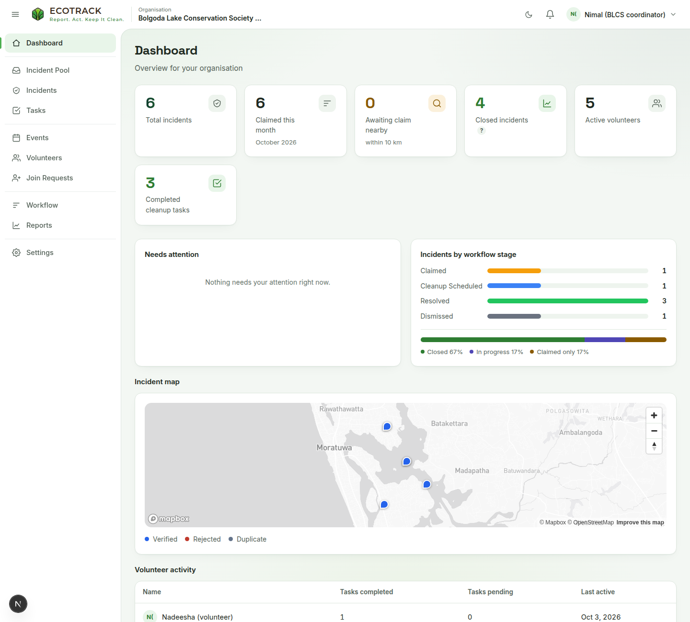
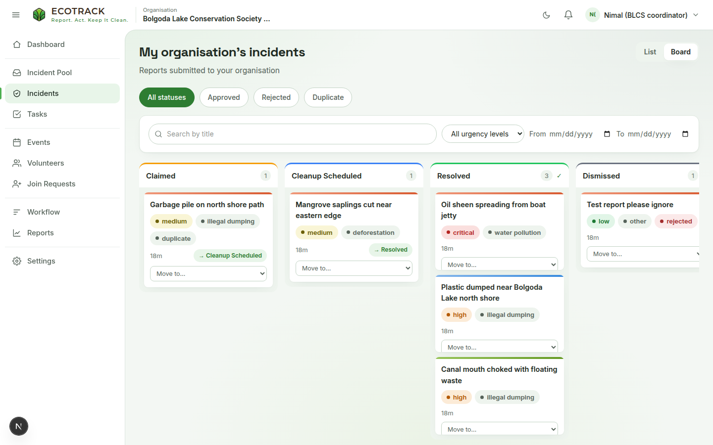
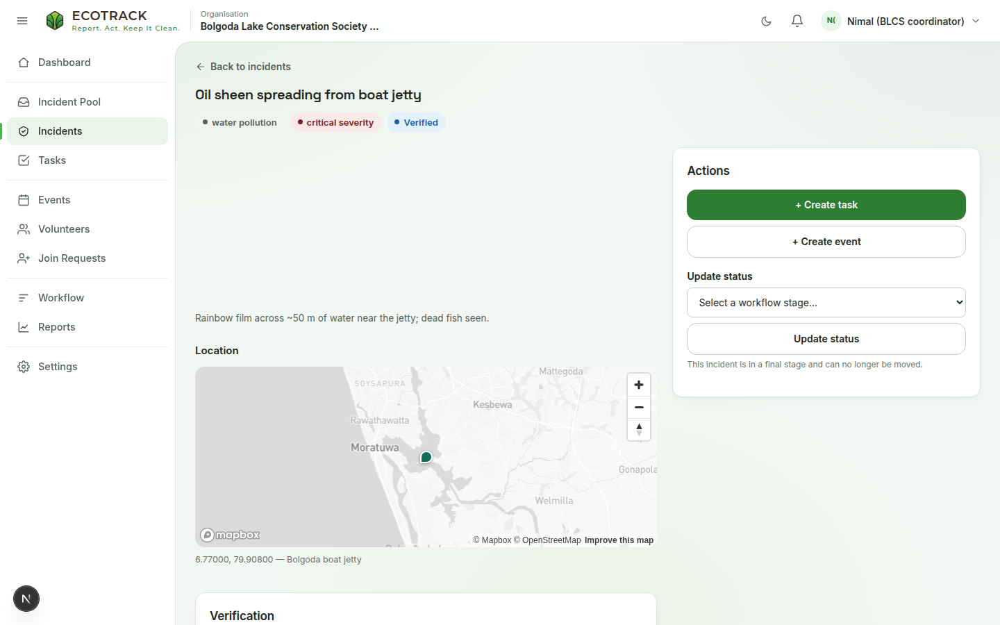
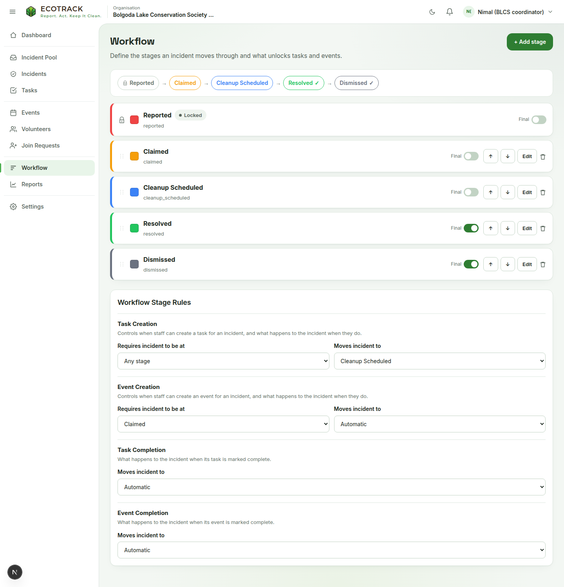
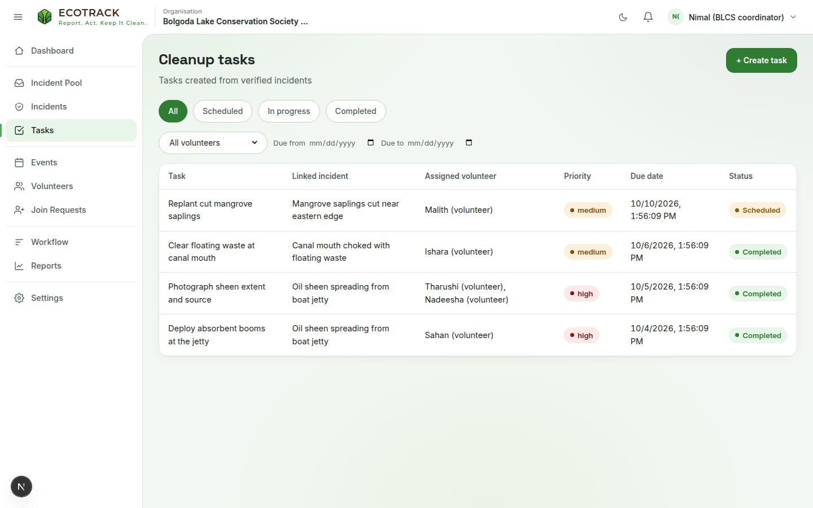
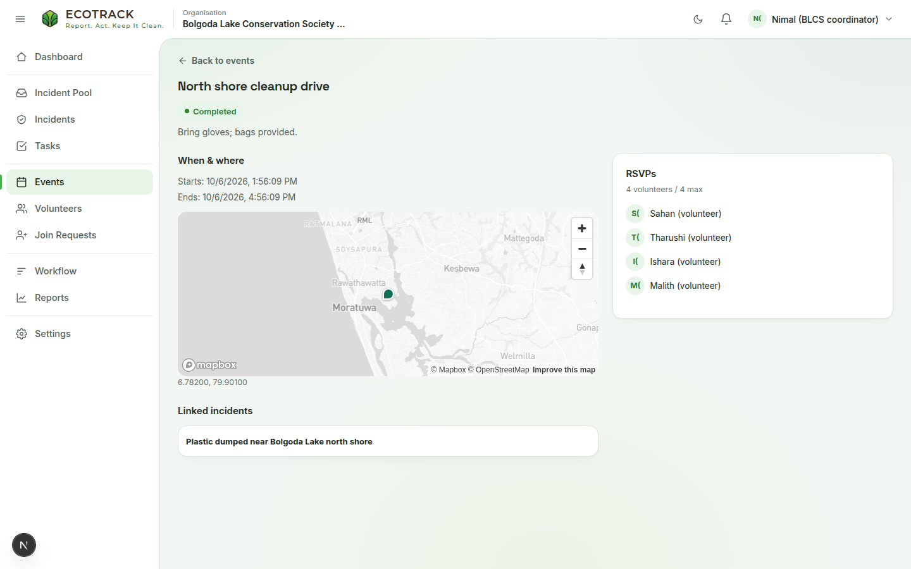
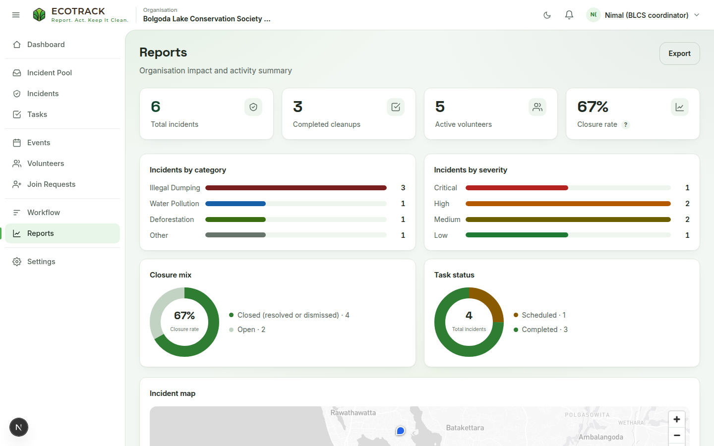

# Organisation admins: the web dashboard

Go to [https://ecotrack.tech](https://ecotrack.tech) and click **Log in**. The left sidebar has: Dashboard, Incident Pool, Incidents, Tasks, Events, Volunteers, Join Requests, Workflow, Reports and Settings. The bell icon at the top shows notifications, and the moon icon switches to dark mode.

## Register an organisation

You only do this once. Sign in, then choose **Register your organisation**. Enter the organisation name, contact email and an optional description. Then pick the **service area** (a centre point and radius). Incidents reported inside that radius appear in your Incident Pool. You become the organisation's first admin.

## Dashboard

The dashboard shows total incidents, incidents claimed this month, incidents awaiting claim nearby, closed incidents, active volunteers and completed tasks. It also shows a *Needs attention* list, a chart of incidents per workflow stage, the cleanup progress bar, an incident map, and volunteer and recent activity.

## Incident Pool: claiming reports

{/* TODO(screenshots): add an Incident Pool screenshot that shows unclaimed reports. */}

The pool lists new reports in your service area that no organisation has claimed yet. You can filter by distance, sort by *Nearest*, *Newest* or *Most severe*, or search. Open a report to see its photos and location, then click **Claim incident**. Claiming makes the incident your organisation's and marks it verified, all in one step. The citizen who reported it is notified.

## Incidents

**Incidents** shows every incident your organisation has claimed. Switch between **List** and **Board** view. You can filter by status, workflow stage, urgency and date. In Board view, use **→ next stage** or **Move to…** to move an incident to another stage.

On an incident's own page you can:

- **Verification:** **Reject** the incident (you must give a reason) or **Mark as duplicate** (you must pick the original incident).
- **Update status:** move the incident to any workflow stage.
- **+ Create task** or **+ Create event** for the incident.
- **Dismiss incident**, if it is not yet in a final stage.

## Workflow: stages and rules

Each organisation sets its own list of stages, for example *Claimed → Cleanup Scheduled → Resolved*.

- **+ Add stage** creates a stage with a name, description and badge colour.
- Use the arrows to reorder stages, **Edit** to change one, or **Delete** to remove one. A stage marked *Locked* is fixed and can't be moved or deleted.
- **Final** marks a stage as closing the incident (for example *Resolved* or *Dismissed*).

The **Workflow Stage Rules** panel sets four things:

- **Task Creation:** the stage an incident must reach before you can create a task for it, and the stage it moves to when you do.
- **Event Creation:** the same, for events.
- **Task Completion:** the stage the incident moves to when its task is completed.
- **Event Completion:** the stage the incident moves to when its event is completed.

Click **Save rules** to apply your changes.

## Tasks

Click **+ Create task**, choose an eligible incident, enter a title and description, assign a volunteer, then set the priority and due date. The task list can be filtered by status (Scheduled, In progress, Completed, Cancelled), volunteer and due date. Open a task to follow its progress and see the evidence photos the volunteer uploaded.

## Events

Click **+ Create event**, select one or more eligible incidents, and enter a title, description, location, start and end times and an optional attendee limit. Volunteers see the event in their app and can RSVP. The event page shows the RSVPs and has **Mark ongoing**, **Mark completed** and **Cancel event** buttons. If you cancel an event, volunteers who RSVPed are notified.

## Volunteers, join requests and invite links

{/* TODO(screenshots): add a Join Requests screenshot that shows a pending request. */}

- **Join Requests:** approve or reject citizens who asked to volunteer. Either way, they are notified.
- **Volunteers:** search and sort your volunteers, then open a profile to see their task history and evidence. **Remove Volunteer** sends their in-progress tasks back to pending and cancels their future RSVPs.
- **Settings → Invite links:** **Generate invite link** lets you set a maximum number of uses and the number of days before it expires. The link is shown only once, so copy it and share it. You can **Revoke** a link at any time.

## Reports and settings

**Reports** shows your organisation's impact: total incidents, completed cleanups, active volunteers and closure rate. It has charts by category, severity, closure mix and task status, plus an incident map. **Export** downloads the figures as a CSV file.

**Settings** is where you edit the organisation's name, description, contact email and service area, and see members and invite links. Changing the service area only affects which new incidents appear in your pool.
