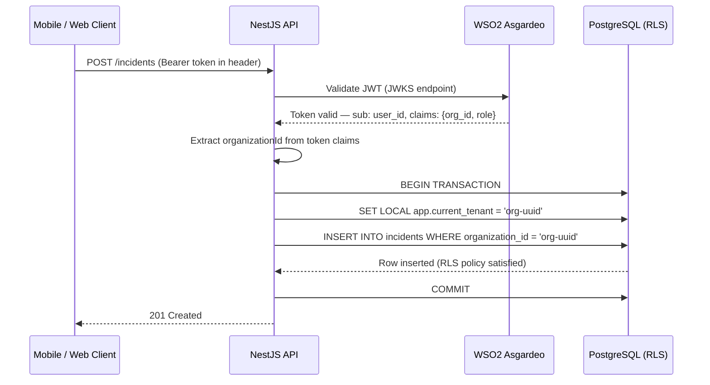
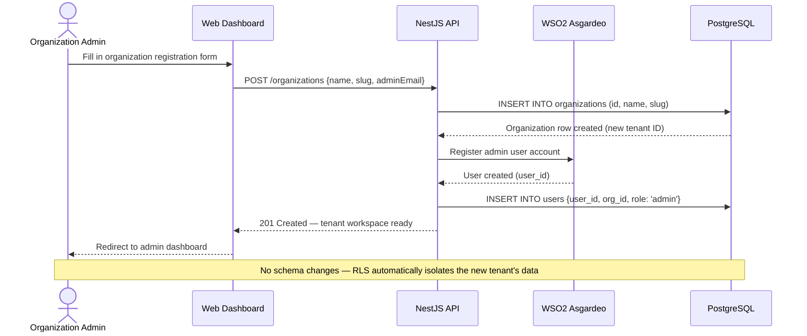

# Multi-Tenancy

This page explains how EcoTrack isolates data between independent tenant organizations on a single shared infrastructure — from the database strategy through to the RLS policy implementation and tenant onboarding flow.

---

## Strategy: Shared Database, Shared Schema

EcoTrack uses a **Shared Database, Shared Schema** multi-tenancy model with PostgreSQL Row-Level Security (RLS).

The two common alternatives and why they were rejected:

| Strategy | Description | Why Rejected |
|---|---|---|
| **Database-per-Tenant** | Each organization gets its own PostgreSQL instance | Financially unfeasible — each instance requires dedicated compute and storage; cannot run within AWS Free Tier |
| **Schema-per-Tenant** | Each organization gets its own set of tables within a shared PostgreSQL instance | Operationally complex — schema migrations must be applied per-tenant; provisioning a new tenant requires DDL statements |
| **Shared Schema + RLS** ✓ | All tenants share the same tables; isolation enforced by PostgreSQL RLS policies | Zero provisioning overhead; runs entirely within a single RDS instance; isolation enforced at the database engine level |

The shared schema model allows a new tenant to be onboarded by a single `INSERT` into the `organizations` table, with no schema changes required.

---

## Data Model: `organization_id` Pattern

Every multi-tenant table carries an `organization_id` foreign key column that references the `organizations` table. This column is the anchor for all RLS policies.

```sql
-- Core organizations table (one row per tenant)
CREATE TABLE organizations (
  id          UUID PRIMARY KEY DEFAULT gen_random_uuid(),
  name        TEXT NOT NULL,
  slug        TEXT UNIQUE NOT NULL,
  created_at  TIMESTAMPTZ NOT NULL DEFAULT now()
);

-- Example: incidents table with tenant anchor
CREATE TABLE incidents (
  id              UUID PRIMARY KEY DEFAULT gen_random_uuid(),
  organization_id UUID NOT NULL REFERENCES organizations(id) ON DELETE CASCADE,
  title           TEXT NOT NULL,
  description     TEXT,
  location        GEOGRAPHY(POINT, 4326) NOT NULL,  -- PostGIS spatial type
  status          TEXT NOT NULL DEFAULT 'reported',
  reported_by     UUID NOT NULL REFERENCES users(id),
  media_urls      TEXT[],
  created_at      TIMESTAMPTZ NOT NULL DEFAULT now(),
  updated_at      TIMESTAMPTZ NOT NULL DEFAULT now()
);
```

The same `organization_id` pattern is applied to: `tasks`, `events`, `workflow_stages`, `volunteer_memberships`, and all other tenant-scoped tables.

---

## Row-Level Security (RLS) Policies

PostgreSQL RLS policies are attached directly to each tenant-scoped table. When RLS is enabled on a table, **every query — including those from the database superuser — is filtered through the policy unless the `BYPASSRLS` privilege is granted**.

### Enabling RLS and Defining a Policy

```sql
-- Enable RLS on the incidents table
ALTER TABLE incidents ENABLE ROW LEVEL SECURITY;

-- Policy: a row is visible only if its organization_id matches the current session variable
CREATE POLICY tenant_isolation ON incidents
  USING (organization_id = current_setting('app.current_tenant')::UUID);
```

The same pattern is applied to every tenant-scoped table. A single `app.current_tenant` session variable gates all data access.

### Session Variable Injection (NestJS)

The NestJS backend injects the tenant session variable at the start of every authenticated request. This happens in a **database middleware** that wraps each request in a transaction:

```typescript
// Simplified tenant middleware — sets the RLS session variable per request
async function setTenantContext(
  db: DrizzleClient,
  organizationId: string,
  handler: () => Promise<void>,
): Promise<void> {
  await db.transaction(async (tx) => {
    // Set the session variable that RLS policies read
    await tx.execute(
      sql`SELECT set_config('app.current_tenant', ${organizationId}, true)`
    );
    await handler();
  });
}
```

The `organizationId` is extracted from the validated Asgardeo JWT claim on every authenticated request, then injected into the database session before any query runs.

:::warning RLS Bypass Risk
Never grant `BYPASSRLS` to the application database role. The application role should only have `SELECT`, `INSERT`, `UPDATE`, and `DELETE` on tenant-scoped tables — **not** superuser privileges. Superuser access should be restricted to migration tooling only.
:::

---

## Asgardeo + RLS Integration

WSO2 Asgardeo handles **authentication** (who the user is). PostgreSQL RLS handles **tenancy** (which organization's data they can see). The two are bridged in the NestJS Auth Guard:



This separation means:
- **Asgardeo's free tier limitation** (3 B2B organizations) is irrelevant — tenant mapping is done at the DB layer.
- A user's `organizationId` comes from the JWT claim set at login time, not from Asgardeo's organizational structure.
- The platform can scale to hundreds of tenant organizations on the Asgardeo free tier (7,500 Consumer MAU) without any Asgardeo plan upgrade.

---

## Tenant Onboarding Flow

New organizations are onboarded via the platform's self-registration flow. No manual infrastructure provisioning is required.



### Volunteer Onboarding

Volunteers join a tenant via one of two paths:

1. **Organization Directory** — A volunteer browses the public organization list, finds their local group, and submits a membership request. The Organization Admin approves or rejects it.
2. **Cryptographic Invite Link** — The Organization Admin generates a signed, time-limited invite link from the dashboard and shares it directly. The volunteer clicks the link, completes registration, and is automatically added to the tenant with the `volunteer` role.

Both paths result in a row in the `volunteer_memberships` table with `organization_id` set, which is immediately covered by the existing RLS policies.

---

## Path-Based Routing vs. Subdomains

EcoTrack uses **path-based tenant routing** (e.g., `platform.com/dashboard/bolgoda-lake`) rather than subdomain routing (e.g., `bolgoda-lake.platform.com`) for two reasons:

1. **Mobile deep-linking:** Subdomains complicate React Native deep-link URL schemes and require wildcard SSL certificates.
2. **Public discoverability:** All organizations are discoverable from a single global directory page, enabling volunteer recruitment across tenant boundaries.
