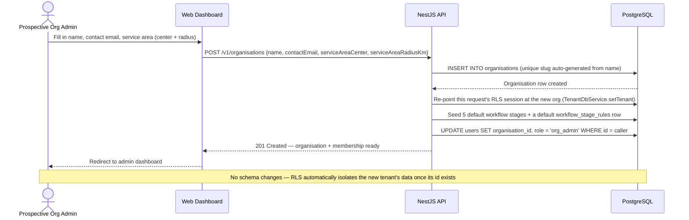

# Multi-Tenancy

This page explains how EcoTrack isolates data between independent organisations on a single shared infrastructure — from the database strategy through to the actual RLS policy mechanism, its deliberate exceptions, and the organisation onboarding flow.

---

## Strategy: Shared Database, Shared Schema

EcoTrack uses a **Shared Database, Shared Schema** multi-tenancy model with PostgreSQL Row-Level Security (RLS).

The two common alternatives and why they were rejected:

| Strategy | Description | Why Rejected |
|---|---|---|
| **Database-per-Tenant** | Each organisation gets its own PostgreSQL instance | Financially unfeasible — each instance requires dedicated compute and storage; cannot run within AWS Free Tier |
| **Schema-per-Tenant** | Each organisation gets its own set of tables within a shared PostgreSQL instance | Operationally complex — schema migrations must be applied per-tenant; provisioning a new tenant requires DDL statements |
| **Shared Schema + RLS** ✓ | All tenants share the same tables; isolation enforced by PostgreSQL RLS policies | Zero provisioning overhead; runs entirely within a single RDS instance; isolation enforced at the database engine level |

A new organisation is onboarded by a single `INSERT` into the `organisations` table, with no schema changes required.

---

## Not every table is RLS-protected

Two tables are **deliberately excluded** from row-level security, because the model isn't "every table scoped to one tenant":

- **`organisations`** — tenant-agnostic by design. Any authenticated user (and, for the public directory, even an unauthenticated one) needs to browse, search, and read organisation profiles regardless of their own membership.
- **`users`** — also tenant-agnostic. A citizen with no organisation still needs their own row read/written (profile, notification preferences); role/org-membership changes need to be readable across the request that changes them; and `JwtStrategy.validate()` reads/writes this table during the guard phase, before a tenant transaction even exists for the request.

Every other tenant-scoped table (`incidents`, `tasks`, `task_assignments`, `task_notes`, `task_photos`, `events`, `event_incidents`, `event_rsvps`, `workflow_stages`, `workflow_stage_rules`, `join_requests`, `invitations`, `invite_links`, `notifications`, `audit_logs`) carries an `organisation_id` (or, for a task/event's child rows, a denormalized copy of the parent's) and an RLS policy anchored to it.

`incidents` has its own further exception, described below: it is RLS-protected, but its policy has a pool-visibility carve-out, because an unclaimed incident by definition has no tenant yet.

---

## Session Variables and the Request-Scoped Connection

Each policy reads one or more of four Postgres session variables (custom GUCs), all namespaced under `app.*`:

| Variable | Set from |
|---|---|
| `app.current_tenant` | The caller's `organisationId`, resolved from their `users` row (not from any JWT claim) |
| `app.current_user_id` | The caller's own user id |
| `app.is_org_admin` | Whether the caller's DB-resolved `role` is `org_admin` |
| `app.is_platform_admin` | The caller's `users.isPlatformAdmin` flag |

These are set once per HTTP request by `TenantInterceptor`, a global `APP_INTERCEPTOR` that runs **after** all guards (so `request.user` — resolved by `JwtStrategy` from the validated Asgardeo token — is already populated) and wraps the rest of the request in one Postgres transaction:

```typescript
// Simplified — see common/interceptors/tenant.interceptor.ts
const client = await pool.connect();
await client.query('BEGIN');
await client.query(`SELECT set_config('app.current_tenant', $1, true)`, [user?.organisationId ?? '']);
await client.query(`SELECT set_config('app.current_user_id', $1, true)`, [user?.id ?? '']);
await client.query(`SELECT set_config('app.is_org_admin', $1, true)`, [String(user?.role === 'org_admin')]);
await client.query(`SELECT set_config('app.is_platform_admin', $1, true)`, [String(user?.isPlatformAdmin ?? false)]);
// A Drizzle instance bound to this exact connection is stashed in CLS
// (nestjs-cls) for every service in the request to use as `tenantDb.db`.
```

`set_config(..., true)` is transaction-scoped (`SET LOCAL` semantics) rather than a plain `SET`, deliberately — connections are pulled from a pool, and a plain `SET` would leak one request's tenant into whichever request borrows the same physical connection next. The transaction commits on a successful response and rolls back on any thrown error.

Services never query the pool-wide Drizzle instance for tenant-scoped tables. They inject `TenantDbService` and read `tenantDb.db` — the request-scoped, RLS-activated connection stashed in [`nestjs-cls`](https://github.com/Papooch/nestjs-cls) async-local-storage by the interceptor above. Querying an RLS-protected table through the *pool-wide* connection instead would not error — it would just, correctly but unhelpfully, return zero rows, since that connection's session variables were never set.

This runs on **every** request, authenticated or not: a `@Public()` route with no `request.user` gets all four variables set to `''`/`'false'`, under which every RLS policy correctly resolves to "nothing visible" for a protected table — which is fine, because public routes only ever touch the two RLS-exempt tables (`organisations`, `users`) or an explicit read-widening exception (below).

### Defining a policy

```sql
ALTER TABLE tasks ENABLE ROW LEVEL SECURITY;

CREATE POLICY tenant_isolation ON tasks
  USING (
    organisation_id::text = current_setting('app.current_tenant', true)
    OR current_setting('app.is_platform_admin', true) = 'true'
  );
```

:::warning RLS Bypass Risk
Never grant `BYPASSRLS` to the application database role. It should only have `SELECT`/`INSERT`/`UPDATE`/`DELETE` on tenant-scoped tables — never superuser privileges. Superuser access is restricted to migration tooling only.
:::

---

## Deliberate exceptions to plain tenant scoping

A handful of reads and writes are *legitimately* cross-tenant, and each has its own narrow, explicit escape hatch rather than a broad RLS bypass:

| Case | Mechanism |
|---|---|
| **Global Incident Pool.** An unclaimed incident (`organisation_id IS NULL`) must be visible to every organisation browsing the pool, and claimable by whichever one gets there first. | The `incidents` RLS policy itself has an `organisation_id IS NULL` branch. Claim atomicity comes from a conditional `UPDATE ... WHERE organisation_id IS NULL`, not from RLS or row locking — see [Incidents](../03-api/incidents#the-global-incident-pool). |
| **Public hazard map.** `GET /v1/incidents/nearby` and the public fallback on `GET /v1/incidents/:id` must read incidents outside the caller's own tenant, with a reduced projection. | The service explicitly runs `SELECT set_config('app.public_map_read', 'true', true)` (transaction-local — reverts at commit) before the query; a dedicated, `SELECT`-only policy reads that flag. |
| **Invitation / invite-link token lookup.** A citizen with no organisation needs to look up or redeem a token belonging to some other org, before they have any membership there. | The secret token itself is the authorization. The service sets `app.invitation_token_lookup` before the query; the token is unguessable (128-bit random, hashed at rest for invite links), so this is safe. |
| **Join-request submission's admin notification + audit entry.** A citizen submitting a join request has an empty tenant, but the notification/audit rows it creates are scoped to the *target* org. | The service sets `app.join_request_submission` before those two specific writes; the `join_requests` insert itself needs no such flag, since it's authorized by `user_id = current_user_id` directly. |
| **Media object-key authorization.** `GET /v1/media/:objectKey` must also authorize a key that backs a *publicly map-eligible* incident, not only ones the caller's own tenant session can see. | Same `app.public_map_read` flag as the hazard map, tried as a fallback only if the caller's own session can't already see the row. |
| **The notification-dispatch cron.** Runs outside any HTTP request — no CLS context, no user to derive session variables from. | `SystemDbService.runAsSystem()` opens its own transaction and explicitly sets all four session variables itself (`app.is_platform_admin = true`, the other three empty/false) on every run — not just the one that matters, because a physical connection borrowed from the same pool may have a stale custom GUC left over from a previous request, and reading an unset-since-transaction-start custom GUC returns `''` rather than `NULL`, which fails a bare boolean cast. |

None of these read as a real bypass: each is a narrowly-scoped, explicitly-flagged carve-out on top of RLS, not a role that skips it.

---

## Path-Based Organisation Scoping, Not Implicit-From-Token

Most write and detail routes take an explicit `:organisationId` path parameter (`/v1/organisations/:organisationId/tasks`, not an implicit "whatever org the token says"). A global `TenantGuard` — which runs after `JwtAuthGuard` and before `RolesGuard` — checks that parameter against the caller's own `organisationId` (already resolved from the `users` table for this request by `JwtStrategy`, not re-queried) and throws `403` on a mismatch. A platform admin is exempt from this check entirely. Routes with no `:organisationId` parameter (the incident pool, the public directory, a citizen's own reports) are untouched by this guard — their scoping, if any, comes from RLS or from an explicit ownership check in the service instead.

```mermaid
sequenceDiagram
  participant Client as Mobile / Web Client
  participant Guard as JwtAuthGuard + TenantGuard + RolesGuard
  participant Interceptor as TenantInterceptor
  participant DB as PostgreSQL (RLS)

  Client->>Guard: PATCH /v1/organisations/{orgId}/tasks/{id} (Bearer token)
  Guard->>Guard: Validate JWT against Asgardeo JWKS
  Guard->>Guard: Resolve role/organisationId from `users` (JIT-provision if new sub)
  Guard->>Guard: Check path {orgId} == user.organisationId (or platform admin)
  Guard->>Guard: Check role against @Roles()
  Guard-->>Interceptor: request.user populated
  Interceptor->>DB: BEGIN; set_config(app.current_tenant, ...), etc.
  Interceptor->>DB: UPDATE tasks ... (RLS policy evaluated per row)
  DB-->>Interceptor: Rows affected (RLS-satisfying rows only)
  Interceptor->>DB: COMMIT
  Interceptor-->>Client: 200 OK
```

This means:
- **Asgardeo's free-tier limitation** (3 B2B organisations) is irrelevant — organisation membership is resolved entirely at the application/DB layer, never from Asgardeo's own org model.
- A user's `role`/`organisationId` always reflects the current `users` row, re-read on every request — no JWT claim to go stale, no re-login required after a membership change.

---

## Organisation Onboarding Flow

Any authenticated user may self-register an organisation; a **service area is required at registration**, not optional — `serviceAreaCenter` (a point) plus `serviceAreaRadiusKm` (one of `1`/`5`/`10`/`25`/`50`). This is what determines which pooled incidents the org can claim and gates join-request/invite-link eligibility for prospective volunteers.


```mermaid
sequenceDiagram
  actor OrgAdmin as Prospective Org Admin
  participant Web as Web Dashboard
  participant API as NestJS API
  participant DB as PostgreSQL

  OrgAdmin->>Web: Fill in name, contact email, service area (center + radius)
  Web->>API: POST /v1/organisations {name, contactEmail, serviceAreaCenter, serviceAreaRadiusKm}
  API->>DB: INSERT INTO organisations (unique slug auto-generated from name)
  DB-->>API: Organisation row created
  API->>DB: Re-point this request's RLS session at the new org (TenantDbService.setTenant)
  API->>DB: Seed 5 default workflow stages + a default workflow_stage_rules row
  API->>DB: UPDATE users SET organisation_id, role = 'org_admin' WHERE id = caller
  API-->>Web: 201 Created — organisation + membership ready
  Web-->>OrgAdmin: Redirect to admin dashboard

  Note over OrgAdmin,DB: No schema changes — RLS automatically isolates the new tenant's data once its id exists
```

The mid-request `setTenant` re-point above exists because `TenantInterceptor` set this request's session variables from the caller's *pre-existing* organisation — empty, for someone registering their first org — before the `INSERT` created the new one. Everything written after the re-point (default stages, the audit entry) targets the brand-new organisation id instead.

### Volunteer Onboarding

A prospective volunteer joins an organisation one of two ways, both gated by the target org's service area against a **freshly submitted** location (never a stored one):

1. **Join Request** — `POST /v1/organisations/join-request` with the citizen's current `lat`/`lng`. An admin approves or rejects it. Approval sets `role: volunteer` and `organisationId` immediately.
2. **Shareable Invite Link** — an admin generates a token-bearing link (optionally use-capped); the citizen redeems it via `POST /v1/organisations/invites/accept`, again submitting a fresh `lat`/`lng`.

Both paths are checked against the same predicate: `ST_DWithin(organisation.service_area_center, submitted_point, service_area_radius_km * 1000)`. A location outside that area gets a `422`. See [Organisations](../03-api/organizations#join-requests) for the full request/response shapes.

---

## Path-Based Routing vs. Subdomains

EcoTrack uses **path-based tenant routing** (e.g., `ecotrack-web.example.com/orgs/bolgoda-lake-conservation-society`, backed by `GET /v1/organisations/by-slug/:slug`) rather than subdomain routing, for two reasons:

1. **Mobile deep-linking:** Subdomains complicate React Native deep-link URL schemes and require wildcard SSL certificates.
2. **Public discoverability:** All organisations are discoverable from a single global directory (`GET /v1/organisations/public`), enabling volunteer recruitment across organisation boundaries.
