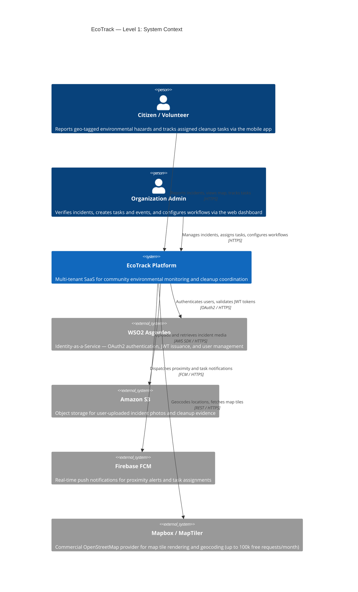
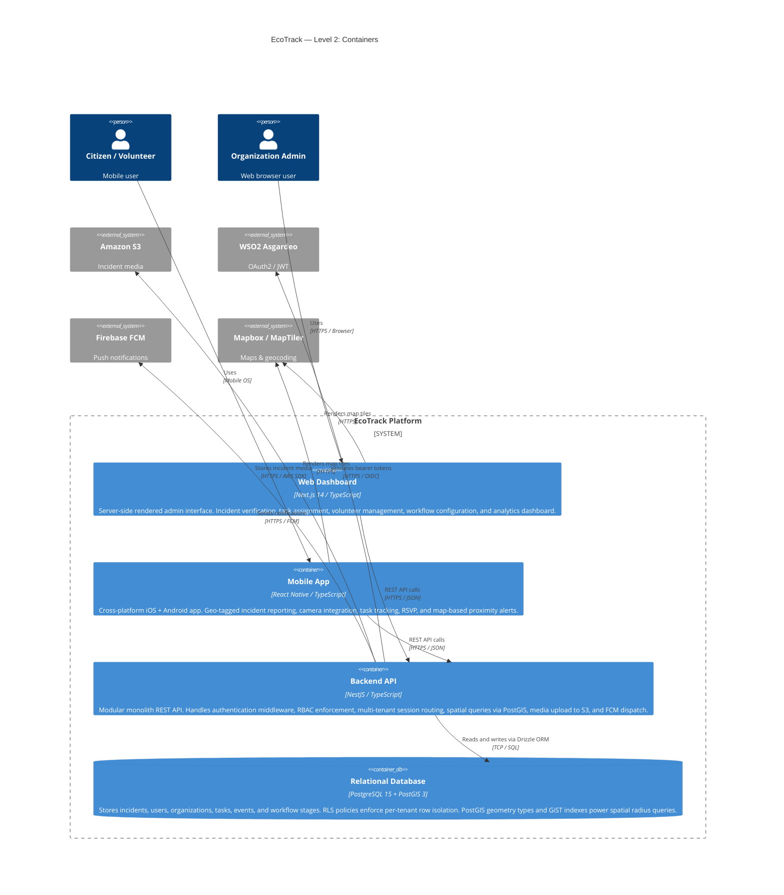
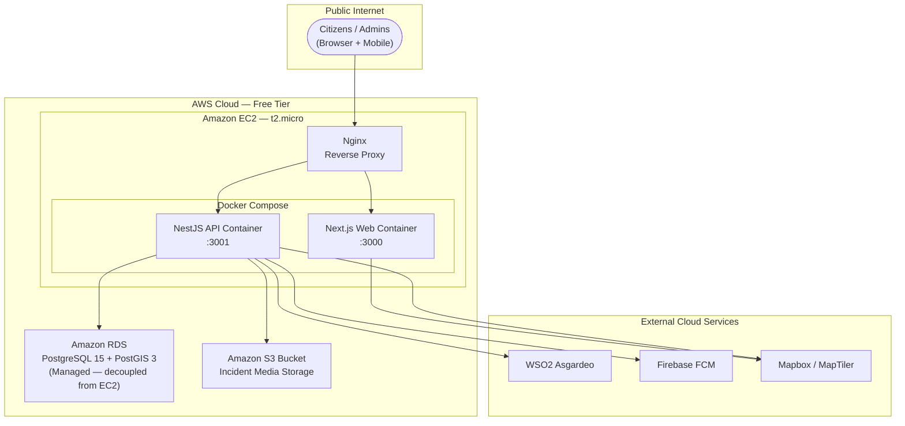

# System Context

This page presents the EcoTrack platform at two levels of abstraction: **Level 1** (system context — who uses it and what it talks to) and **Level 2** (containers — what the system is made of internally). A third diagram shows how those containers are deployed on AWS infrastructure.

---

## Level 1 — System Context

The system context diagram shows EcoTrack as a black box alongside the people who use it and the external systems it integrates with.

### External System Responsibilities

| System | Role in EcoTrack |
|---|---|
| **WSO2 Asgardeo** | Handles all user authentication and OAuth2 token issuance. The NestJS API validates bearer tokens on every request. Tenant data isolation is handled separately via PostgreSQL RLS — not Asgardeo's B2B org model — to scale beyond the free tier's 3-org limit. |
| **Amazon S3** | Stores all unstructured media (incident photos, cleanup evidence). Only the S3 URL is saved in the relational database, preventing BLOB bloat and keeping RDS storage minimal. |
| **Firebase FCM** | Sends real-time push notifications to mobile devices — proximity alerts for nearby incidents and task assignment notifications. |
| **Mapbox / MapTiler** | Provides enterprise-grade OSM tile infrastructure for the incident map. Chosen over direct public OSM servers (which enforce a hard limit of 1 geocoding request/second) and Google Maps (which incurs rapid cost escalation). |

---

## Level 2 — Containers

The container diagram opens EcoTrack's boundary and shows the four internal runtime units and how they communicate.

### Container Descriptions

| Container | Technology | Key Responsibilities |
|---|---|---|
| **Web Dashboard** | Next.js 14, TypeScript | Incident list + verification flow (≤3 clicks), task/event creation, dynamic workflow stage editor, volunteer roster, analytics. SSR via Next.js App Router for SEO on public campaign pages. |
| **Mobile App** | React Native, TypeScript | Incident submission (GPS + camera), assigned task list, event RSVP, evidence upload, proximity alert subscription. Single codebase for iOS and Android. |
| **Backend API** | NestJS, TypeScript | Auth middleware (validates Asgardeo JWT), RBAC guard, tenant session variable injection (for RLS), incident CRUD with PostGIS spatial queries, S3 presigned URL generation, FCM notification dispatch, dynamic workflow CRUD. |
| **Relational Database** | PostgreSQL 15 + PostGIS 3 | Single shared instance for all tenants. RLS policies restrict every row to the current tenant session. PostGIS `geography` columns store incident coordinates; GiST indexes accelerate radius queries to under 500 ms for 95% of requests. |

---

## Infrastructure Deployment

The following diagram shows how the containers are deployed on AWS infrastructure.

### Why EC2 + Managed RDS Instead of a Containerized Database?

Hosting PostgreSQL inside a Docker container on a 1 GB RAM Free Tier `t2.micro` instance risks:

- **Data corruption** on container restarts
- **Out-of-Memory (OOM) crashes** if the DB and API compete for the same RAM budget

By decoupling compute (EC2 + Docker Compose) from storage (Amazon RDS), both layers run cleanly within AWS Free Tier limits with no risk to data integrity. Redis caching is deferred to a post-launch scaling phase for the same OOM reason.
