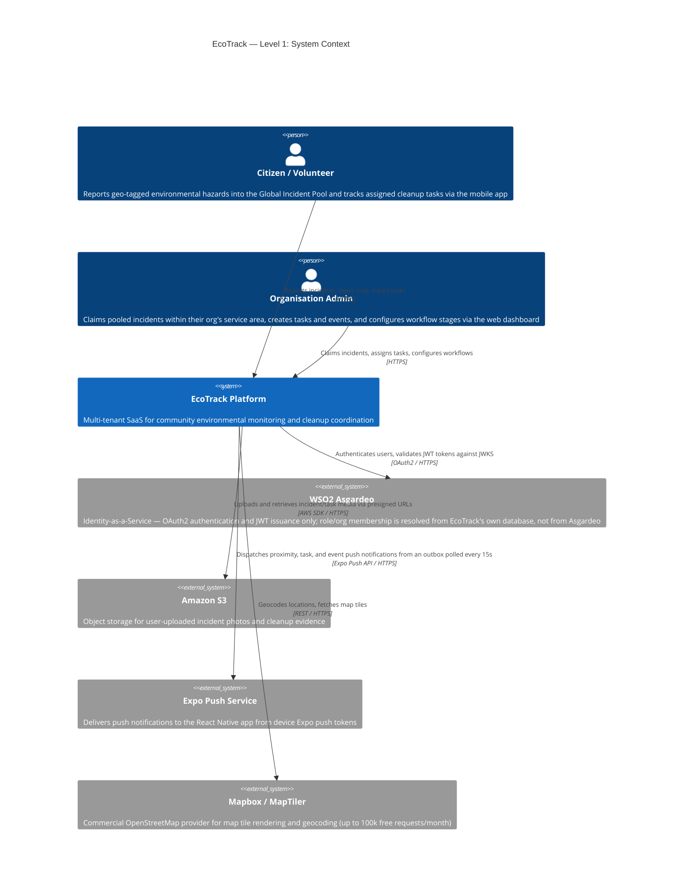
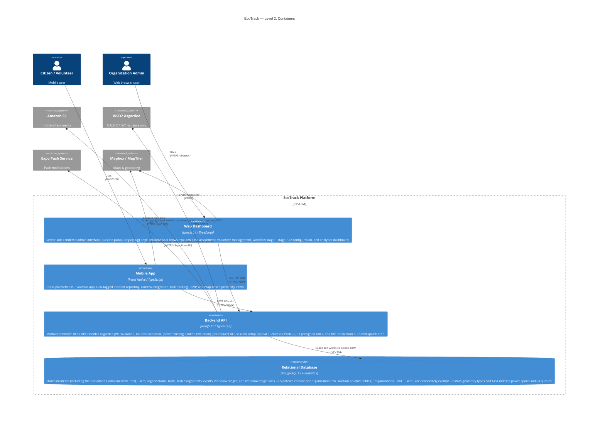
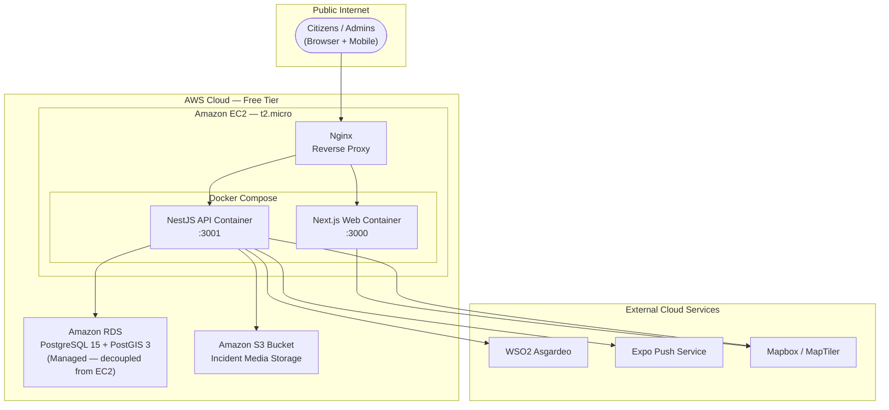

# System Context

This page presents the EcoTrack platform at two levels of abstraction: **Level 1** (system context — who uses it and what it talks to) and **Level 2** (containers — what the system is made of internally). A third diagram shows how those containers are deployed on AWS infrastructure.

---

## Level 1 — System Context

The system context diagram shows EcoTrack as a black box alongside the people who use it and the external systems it integrates with.

```mermaid
C4Context
  title EcoTrack — Level 1: System Context

  Person(citizen, "Citizen / Volunteer", "Reports geo-tagged environmental hazards into the Global Incident Pool and tracks assigned cleanup tasks via the mobile app")
  Person(admin, "Organisation Admin", "Claims pooled incidents within their org's service area, creates tasks and events, and configures workflow stages via the web dashboard")

  System(ecotrack, "EcoTrack Platform", "Multi-tenant SaaS for community environmental monitoring and cleanup coordination")

  System_Ext(asgardeo, "WSO2 Asgardeo", "Identity-as-a-Service — OAuth2 authentication and JWT issuance only; role/org membership is resolved from EcoTrack's own database, not from Asgardeo")
  System_Ext(s3, "Amazon S3", "Object storage for user-uploaded incident photos and cleanup evidence")
  System_Ext(expo, "Expo Push Service", "Delivers push notifications to the React Native app from device Expo push tokens")
  System_Ext(mapbox, "Mapbox / MapTiler", "Commercial OpenStreetMap provider for map tile rendering and geocoding (up to 100k free requests/month)")

  Rel(citizen, ecotrack, "Reports incidents, views map, tracks tasks", "HTTPS")
  Rel(admin, ecotrack, "Claims incidents, assigns tasks, configures workflows", "HTTPS")
  Rel(ecotrack, asgardeo, "Authenticates users, validates JWT tokens against JWKS", "OAuth2 / HTTPS")
  Rel(ecotrack, s3, "Uploads and retrieves incident/task media via presigned URLs", "AWS SDK / HTTPS")
  Rel(ecotrack, expo, "Dispatches proximity, task, and event push notifications from an outbox polled every 15s", "Expo Push API / HTTPS")
  Rel(ecotrack, mapbox, "Geocodes locations, fetches map tiles", "REST / HTTPS")

  UpdateLayoutConfig($c4ShapeInRow="3", $c4BoundaryInRow="1")
```

### External System Responsibilities

| System | Role in EcoTrack |
|---|---|
| **WSO2 Asgardeo** | Handles authentication only — OAuth2 token issuance and JWKS-based verification. The NestJS API validates bearer tokens on every request but does **not** trust any role/organisation claim from the token; it just-in-time provisions a `users` row on first sight of a token subject and resolves role/organisation membership from that row on every request thereafter. This is also why Asgardeo's free-tier limitation (3 B2B organisations) is irrelevant — organisation membership isn't modeled in Asgardeo at all. |
| **Amazon S3** | Stores all unstructured media (incident photos, task completion evidence). Only the object's URL is saved in the relational database, preventing BLOB bloat and keeping RDS storage minimal. Reads are authorization-checked before a presigned GET is issued — not merely obscure-URL protection. |
| **Expo Push Service** | Delivers push notifications to the React Native app (not Firebase Cloud Messaging). The backend never calls it synchronously inline with the triggering request — it writes a row to a `notification_dispatches` outbox table, and a cron polls that table roughly every 15 seconds to fan out proximity alerts, task-due reminders, and event reminders. |
| **Mapbox / MapTiler** | Provides enterprise-grade OSM tile infrastructure for the incident map. Chosen over direct public OSM servers (which enforce a hard limit of 1 geocoding request/second) and Google Maps (which incurs rapid cost escalation). |

---

## Level 2 — Containers

The container diagram opens EcoTrack's boundary and shows the four internal runtime units and how they communicate.

```mermaid
C4Container
  title EcoTrack — Level 2: Containers

  Person(citizen, "Citizen / Volunteer", "Mobile user")
  Person(admin, "Organization Admin", "Web browser user")

  System_Boundary(platform, "EcoTrack Platform") {
    Container(web, "Web Dashboard", "Next.js 14 / TypeScript", "Server-side rendered admin interface, plus the public /orgs/[slug] page. Incident pool browsing/claim, task assignment, volunteer management, workflow stage + stage-rule configuration, and analytics dashboard.")
    Container(mobile, "Mobile App", "React Native / TypeScript", "Cross-platform iOS + Android app. Geo-tagged incident reporting, camera integration, task tracking, RSVP, and map-based proximity alerts.")
    Container(api, "Backend API", "NestJS 11 / TypeScript", "Modular monolith REST API. Handles Asgardeo JWT validation, DB-resolved RBAC (never trusting a token role claim), per-request RLS session setup, spatial queries via PostGIS, S3 presigned URLs, and the notification outbox/dispatch cron.")
    ContainerDb(db, "Relational Database", "PostgreSQL 15 + PostGIS 3", "Stores incidents (including the unclaimed Global Incident Pool), users, organisations, tasks, task assignments, events, workflow stages, and workflow stage rules. RLS policies enforce per-organisation row isolation on most tables; `organisations` and `users` are deliberately exempt. PostGIS geometry types and GiST indexes power spatial radius queries.")
  }

  System_Ext(s3, "Amazon S3", "Incident/task media")
  System_Ext(asgardeo, "WSO2 Asgardeo", "OAuth2 / JWT issuance only")
  System_Ext(expo, "Expo Push Service", "Push notifications")
  System_Ext(mapbox, "Mapbox / MapTiler", "Maps & geocoding")

  Rel(citizen, mobile, "Uses", "Mobile OS")
  Rel(admin, web, "Uses", "HTTPS / Browser")
  Rel(mobile, api, "REST API calls", "HTTPS / JSON")
  Rel(web, api, "REST API calls", "HTTPS / JSON")
  Rel(api, db, "Reads and writes via Drizzle ORM", "TCP / SQL")
  Rel(api, s3, "Stores incident/task media", "HTTPS / AWS SDK")
  Rel(api, asgardeo, "Validates bearer tokens against JWKS", "HTTPS / OIDC")
  Rel(api, expo, "Dispatches notifications from the outbox, polled every 15s", "HTTPS / Expo Push API")
  Rel(mobile, mapbox, "Renders map tiles", "HTTPS")
  Rel(web, mapbox, "Renders map tiles", "HTTPS")
```

### Container Descriptions

| Container | Technology | Key Responsibilities |
|---|---|---|
| **Web Dashboard** | Next.js 14, TypeScript | Incident pool browsing and claim flow, task/event creation, workflow stage + stage-rule editor, volunteer roster, analytics, and the public `/orgs/[slug]` page backed by `GET /v1/organisations/by-slug/:slug`. SSR via Next.js App Router for SEO on public organisation pages. |
| **Mobile App** | React Native, TypeScript | Incident submission (GPS + camera) into the pool, assigned task list, event RSVP, evidence upload, proximity alert subscription via Expo push tokens. Single codebase for iOS and Android. |
| **Backend API** | NestJS 11, TypeScript | Asgardeo JWT validation (JWKS, RS256), just-in-time user provisioning, DB-resolved role/org membership (never a trusted token claim), per-request RLS session variable injection via a request-scoped transaction, incident-pool/claim spatial queries with PostGIS, S3 presigned URL generation, and the notification outbox/dispatch cron (Expo Push, not FCM). |
| **Relational Database** | PostgreSQL 15 + PostGIS 3 | Single shared instance for all organisations. RLS policies restrict most tables to the current tenant session, with narrow, explicit exceptions for the incident pool, public map reads, and token-based lookups (see [Multi-Tenancy](./multi-tenancy)). PostGIS `geography` columns store coordinates; GiST indexes accelerate radius queries to under 500 ms at the 95th percentile. |

---

## Infrastructure Deployment

The following diagram shows how the containers are deployed on AWS infrastructure.

```mermaid
graph TD
  subgraph INTERNET["Public Internet"]
    USERS(["Citizens / Admins\n(Browser + Mobile)"])
  end

  subgraph AWS["AWS Cloud — Free Tier"]
    subgraph EC2["Amazon EC2 — t2.micro"]
      NGINX["Nginx\nReverse Proxy"]
      subgraph DOCKER["Docker Compose"]
        API_C["NestJS API Container\n:3001"]
        WEB_C["Next.js Web Container\n:3000"]
      end
    end

    RDS["Amazon RDS\nPostgreSQL 15 + PostGIS 3\n(Managed — decoupled from EC2)"]
    S3_B["Amazon S3 Bucket\nIncident Media Storage"]
  end

  subgraph EXT["External Cloud Services"]
    ASGARDEO_E["WSO2 Asgardeo"]
    EXPO_E["Expo Push Service"]
    MAPBOX_E["Mapbox / MapTiler"]
  end

  USERS --> NGINX
  NGINX --> WEB_C
  NGINX --> API_C
  API_C --> RDS
  API_C --> S3_B
  API_C --> ASGARDEO_E
  API_C --> EXPO_E
  WEB_C --> MAPBOX_E
  API_C --> MAPBOX_E
```

### Why EC2 + Managed RDS Instead of a Containerized Database?

Hosting PostgreSQL inside a Docker container on a 1 GB RAM Free Tier `t2.micro` instance risks:

- **Data corruption** on container restarts
- **Out-of-Memory (OOM) crashes** if the DB and API compete for the same RAM budget

By decoupling compute (EC2 + Docker Compose) from storage (Amazon RDS), both layers run cleanly within AWS Free Tier limits with no risk to data integrity. Redis caching is deferred to a post-launch scaling phase for the same OOM reason.
