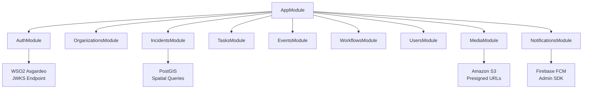
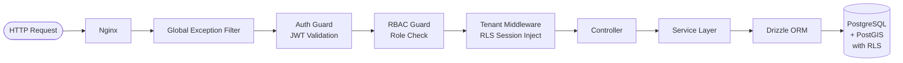

# Backend API

The EcoTrack backend is a **NestJS modular monolith** written in TypeScript, exposing a RESTful API consumed by both the web dashboard and the mobile app. All authentication, multi-tenant data isolation, spatial queries, media handling, and push notification dispatch are handled within this single deployable unit.

---

## Module Structure



---

## Module Breakdown

| Module | Responsibilities | Key External Dependencies |
|---|---|---|
| **AuthModule** | JWT validation against Asgardeo JWKS; extracts `sub`, `roles`, and `organizationId` from token claims | `@nestjs/passport`, `passport-jwt`, `jwks-rsa` |
| **OrganizationsModule** | Tenant registration, invite link generation and validation, join request management, volunteer roster | AuthModule, UsersModule |
| **IncidentsModule** | Incident CRUD, PostGIS `ST_DWithin` radius queries for nearby incidents, status transitions, verification | AuthModule, WorkflowsModule, MediaModule, NotificationsModule |
| **TasksModule** | Task creation from verified incidents, volunteer assignment, completion with evidence URLs | AuthModule, IncidentsModule, UsersModule |
| **EventsModule** | Event creation from verified incidents, RSVP management, attendee lists, event reminders | AuthModule, IncidentsModule, UsersModule, NotificationsModule |
| **WorkflowsModule** | Per-tenant workflow stage CRUD, atomic reorder, stage-in-use validation before deletion | AuthModule |
| **UsersModule** | User profile management, FCM device token registration, role-based user queries | AuthModule |
| **MediaModule** | S3 presigned URL generation for direct client uploads; validates that submitted `mediaUrls` belong to the correct tenant S3 key prefix | AWS SDK v3 (`@aws-sdk/client-s3`, `@aws-sdk/s3-request-presigner`) |
| **NotificationsModule** | Firebase FCM dispatch for proximity alerts, task assignments, and event reminders | Firebase Admin SDK |

---

## Request Lifecycle

Every authenticated API request passes through the following chain before reaching the controller:



### Global Exception Filter

Catches all unhandled exceptions and serializes them into the standard error envelope (see [API Reference](../api#conventions)). Prevents internal stack traces from reaching clients in production.

### Auth Guard (`JwtAuthGuard`)

Validates the bearer token on every protected route by checking the signature against Asgardeo's JWKS endpoint:

```typescript
export class JwtStrategy extends PassportStrategy(Strategy, 'jwt') {
  constructor() {
    super({
      secretOrKeyProvider: passportJwtSecret({
        jwksUri: `https://api.asgardeo.io/t/${process.env.ASGARDEO_ORG_NAME}/oauth2/jwks`,
      }),
      jwtFromRequest: ExtractJwt.fromAuthHeaderAsBearerToken(),
      audience: process.env.ASGARDEO_CLIENT_ID,
    });
  }

  validate(payload: JwtPayload): AuthenticatedUser {
    return {
      userId: payload.sub,
      email: payload.email,
      roles: payload.roles,
      organizationId: payload.organizationId,
    };
  }
}
```

### RBAC Guard (`RolesGuard`)

Checks that the authenticated user's role satisfies the minimum role declared on the route with the `@Roles()` decorator:

```typescript
@Post('/incidents/:id/verify')
@Roles('org_admin')
@UseGuards(JwtAuthGuard, RolesGuard)
async verify(@Param('id') id: string, @CurrentUser() user: AuthenticatedUser) {
  return this.incidentsService.verify(id, user);
}
```

### Tenant Middleware (RLS Session Injection)

Before any Drizzle query executes, this middleware sets the PostgreSQL `app.current_tenant` session variable from the authenticated user's `organizationId`. This activates all RLS policies for the duration of the request's database connection:

```typescript
@Injectable()
export class TenantMiddleware implements NestMiddleware {
  constructor(private readonly db: DrizzleService) {}

  async use(req: RequestWithUser, _res: Response, next: NextFunction) {
    await this.db.execute(
      sql`SELECT set_config('app.current_tenant', ${req.user.organizationId}, true)`
    );
    next();
  }
}
```

See [Multi-Tenancy](../architecture/multi-tenancy) for the full RLS policy implementation.

---

## PostGIS Spatial Queries

The `IncidentsModule` uses Drizzle's raw SQL template literals for PostGIS spatial operations. Standard ORM abstractions cannot represent `ST_DWithin` or `ST_GeogFromText` without a custom extension layer:

```typescript
async findNearby(lat: number, lng: number, radiusMetres: number) {
  return this.db.execute(sql`
    SELECT
      id,
      title,
      status,
      urgency,
      ST_AsGeoJSON(location)::json AS location,
      ST_Distance(
        location,
        ST_GeogFromText('SRID=4326;POINT(' || ${lng} || ' ' || ${lat} || ')')
      ) AS distance_metres
    FROM incidents
    WHERE ST_DWithin(
      location,
      ST_GeogFromText('SRID=4326;POINT(' || ${lng} || ' ' || ${lat} || ')'),
      ${radiusMetres}
    )
    ORDER BY distance_metres ASC
    LIMIT 50
  `);
}
```

All values are passed as parameterized bindings via Drizzle's `sql` tag. The `incidents.location` column is a PostGIS `GEOGRAPHY(POINT, 4326)` type indexed with a GiST index, enabling sub-500 ms radius queries at the 95th percentile.

---

## Database Schema Overview

The core tables and their multi-tenancy classification:

| Table | Tenant-Scoped | Key Columns |
|---|---|---|
| `organizations` | No (root tenant table) | `id`, `name`, `slug`, `location (geography)` |
| `users` | No (global user directory) | `id`, `asgardeo_sub`, `email` |
| `user_memberships` | Yes | `user_id`, `organization_id`, `role` |
| `incidents` | Yes | `id`, `organization_id`, `location (geography)`, `status`, `urgency` |
| `tasks` | Yes | `id`, `organization_id`, `incident_id`, `assigned_to`, `status` |
| `events` | Yes | `id`, `organization_id`, `incident_id`, `scheduled_at` |
| `event_rsvps` | Yes | `event_id`, `user_id`, `status` |
| `workflow_stages` | Yes | `id`, `organization_id`, `slug`, `order_index`, `is_final` |
| `device_tokens` | No | `user_id`, `fcm_token`, `platform` |

All tables marked "Tenant-Scoped: Yes" have a PostgreSQL RLS policy requiring `organization_id = current_setting('app.current_tenant')::UUID`. See [Multi-Tenancy](../architecture/multi-tenancy) for the full policy SQL.
